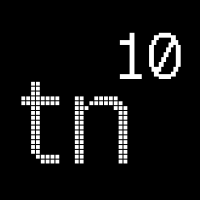

<p align="center">
  
</p>

# Nimbus ☁️


[](https://vercel.com)


**Nimbus** is a sleek and interactive portfolio website built with [Next.js](https://nextjs.org). It showcases projects, skills, and experience with a refined black-and-white aesthetic — featuring sharp corners, animated dot grids, monospace typography, and motion-rich interactions.

---

## Features 🌟

- **Dynamic Content**: Showcases projects, skills, and blog posts dynamically.
- **Custom Animations**: Smooth transitions and modern animations enhance UX.
- **Responsive Design**: Fully optimized for desktops, tablets, and mobile devices.
- **Theming**: Built-in light and dark mode toggle.
- **Optimized Fonts**: Includes `Outfit` and `Geist Mono` fonts, optimized via `next/font`.
- **Effortless Deployment**: Designed for seamless deployment on Vercel.
- **Blogging**: Support for blogging (Markdown-based).

---

## Getting Started 🚀

### Prerequisites

Ensure you have the following installed:

- **Node.js**: v22 or later.
- **Package Manager**: `npm`

---

### Installation ⚙️

1. Clone the repository:  

   ```bash
   git clone https://github.com/your-username/nimbus.git
   cd nimbus

2. Install dependencies:

   ```bash
   npm install
   ```

3. Start the development server:

   ```bash
   npm run dev
   ```

4. Open your browser at `http://localhost:3000` to see Nimbus in action.

---

### Deployment 📦

Nimbus is designed to be deployed effortlessly on Vercel.

For more deployment options, check out the Next.js [Deployment Documentation](https://vercel.com/new?utm_medium=default-template&filter=next.js&utm_source=create-next-app&utm_campaign=create-next-app-readme).

---

### Project Structure 📂

```bash
nimbus/
├── blog/               # Directory for blogs
├── books/              # Directory for books
├── public/             # Static assets like images, fonts, and favicon
├── src/                # Main source code directory
│   ├── app/            # Next.js App directory (for routing, layouts, and pages)
│   ├── components/     # Reusable React components (e.g., BentoGrid, ProjectCard)
│   ├── containers/     # Page-specific container components
│   ├── constants/      # Application-wide constants (e.g., values, themes)
│   ├── data/           # Static or dynamic data (e.g., projects, resume info)
│   ├── utils/          # Utility functions for common operations
├── next.config.js      # Next.js configuration file
├── tsconfig.json       # TypeScript configuration file
├── postcss.config.mjs  # PostCSS configuration file for TailwindCSS
├── tailwind.config.ts  # TailwindCSS configuration file
├── .commitlintrc.yml   # Commitlint configuration to enforce commit message conventions
├── biome.json          # BiomeJS configuration for linting and code quality
├── .nvmrc              # Node version file to specify the Node.js version
├── package.json        # Dependencies and npm/yarn scripts
├── LICENSE.md          # License for the project
└── README.md           # Project documentation
```

---

## License 📜

This project is licensed under the MIT License. See the [LICENSE](LICENSE.md) file for details.

---

## Acknowledgments 🙌

- Named after the mythological **Nimbus**, a radiant cloud often associated with divine presence.
- Built with ❤️ and Next.js.
